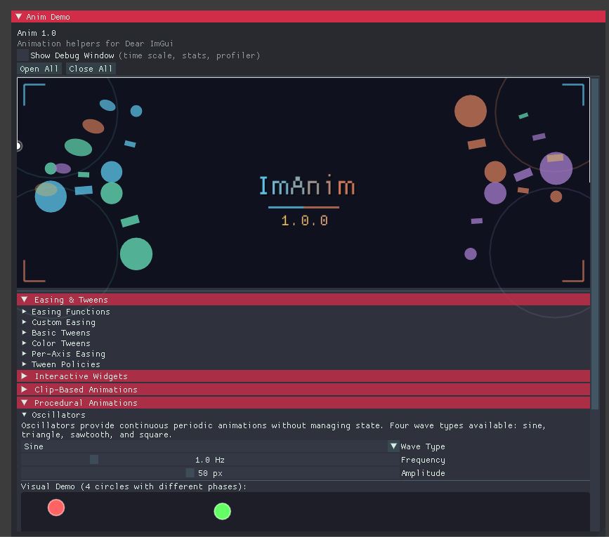

# ofxImAnim


[](../LICENSE)


**openFrameworks wrapper addon for [ImAnim](https://github.com/soufianekhiat/ImAnim)** — a lightweight, zero-dependency animation engine for Dear ImGui.

ImAnim brings modern, buttery-smooth UI animations (tweens, timeline clips, paths, procedural effects, color blending, etc.) to ImGui while staying true to its immediate-mode philosophy.
`ofxImAnim` makes it dead-simple to use all of that power inside openFrameworks (together with `ofxImGui`).

## Example



---

## Features

- Animate `float`, `ImVec2`, `ImVec4`, `int`, and `ImColor` properties
- Timeline **Clips** with keyframes, looping, staggering, chaining and callbacks
- 30+ easing functions (springs, bounce, cubic-bezier, steps, etc.) + per-axis control
- Bézier curves, Catmull-Rom splines, motion paths and text-along-path
- Procedural animations (Perlin/Simplex noise, oscillators, shake, wiggle)
- Perceptual color blending (OKLAB / OKLCH)
- Transform animations (position, rotation, scale)
- Built-in debug inspector, profiler, save/load and memory tools

---

## Installation

1. Clone or download this repository into your `openFrameworks/addons/` folder (or use the Project Generator).
2. Add `ofxImAnim` (and its dependency `ofxImGui`) to your project.
3. Make sure you have a working ImGui integration (recommended: [ofxImGui](https://github.com/Daandelange/ofxImGui)).

---

## Dependencies

- [`ofxImGui`](https://github.com/Daandelange/ofxImGui) (or any compatible Dear ImGui addon)

- Embedded [](https://github.com/soufianekhiat/ImAnim)

---

## Quick Usage

After `ImGui::NewFrame()` in your `ofApp::draw()`:

```cpp
// Update animation engine
iam_update_begin_frame();
iam_clip_update(ImGui::GetIO().DeltaTime);

// Your ImGui code with animations...
if (ImGui::Button("Animate Me")) {
    // example tween (see original ImAnim for full API)
    iam_tween_float("myValue", 0.0f, 1.0f, 0.6f, IAM_EASE_OUT_BOUNCE);
}

// After ImGui rendering
iam_clip_update(); // (or call once per frame as shown above)


```

| Animated Tag |
|:------------:|
|  |

| Ripple Button |
|:------------:|
|  |

| "Wait" Button |
|:------------:|
|  |

| Data Visualization |
|:------------:|
|  |
|  |

## Showcase

Visual examples of ImAnim capabilities in action.

### Stagger Animations

| List Stagger | Grid Stagger | Card Stagger |
|:------------:|:------------:|:------------:|
|  |  |  |

### Easing & Curves

| Easing Gallery | Custom Bezier | Wave Animations |
|:-------------:|:-------------:|:---------------:|
|  |  |  |

### Colors & Transforms

| Color Blending | Gradient | Transforms |
|:-------------:|:--------:|:----------:|
|  |  |  |

### Paths & Text

| Motion Path | Text Effects | Variations |
|:-----------:|:------------:|:----------:|
|  |  |  |

### Procedural & Integration

| Noise | ImGui Widgets | ImDrawList |
|:-----:|:-------------:|:----------:|
|  |  |  |

### Additional Examples

| Oscillator Waves | Transform Layers |
|:----------------:|:----------------:|
|  |  |
